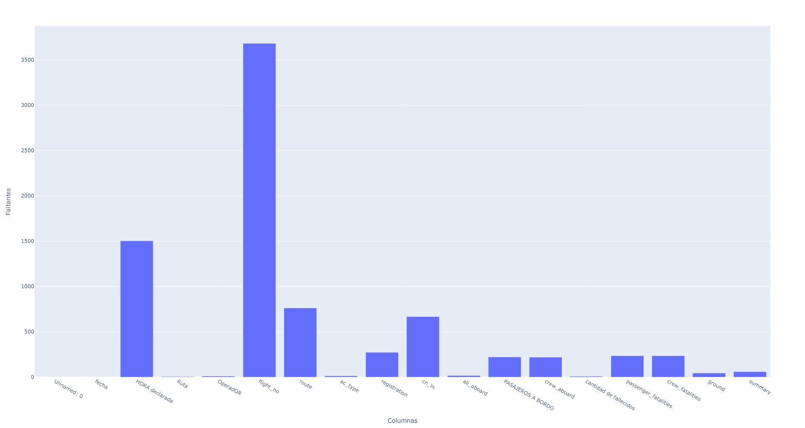

# **PROYECTO INDIVIDUAL Nº3**

# <h1 align="center">**`Accidentes aéreos`**</h1>

## Reporte de Calidad de Datos

### Datos Nulos o Vacios

Si bien no se encontraron valores nulos o vacios, en el dataset original existen valores con el caracter de interrogacion (?), que a primera vista son el equivalente a valores faltantes o ceros

| Columna | Faltantes |
|---------|:----------|
| Unnamed: 0 | 0 |
| fecha | 0 |
| HORA declarada | 1504 |
| Ruta | 5 |
| OperadOR | 10 |
| flight_no | 3682 |
| route | 762 |
| ac_type | 13 |
| registration | 272 |
| cn_ln | 667 |
| all_aboard | 17 |
| PASAJEROS A BORDO | 221 |
| crew_aboard | 219 |
| cantidad de fallecidos | 8 |
| passenger_fatalities | 235 |
| crew_fatalities | 235 |
| ground | 44 |
| summary | 59 |

Otro aspecto que salta a la vista son los nombres de las columnas, se trabajo en el renombre de las mismas

Asimismo el tipo de datos que tiene el dataset en en casi toda su totalidad la de object

| Columna | dtype |
|---------|:----------|
| Unnamed: 0 | int64 |
| fecha | object |
| HORA declarada | object |
| Ruta | object |
| OperadOR | object |
| flight_no | object |
| route | object |
| ac_type | object |
| registration | object |
| cn_ln | object |
| all_aboard | object |
| PASAJEROS A BORDO | object |
| crew_aboard | object |
| cantidad de fallecidos | object |
| passenger_fatalities | object |
| crew_fatalities | object |
| ground | object |
| summary | object |

Entre las columnas que se consideraron a utilizar para realizar el analisis y posterior dashboard tenemos a la columna de :
- fecha: los formatos de esta columna expresan la fecha de manera literal
- fecha ejemplo: September 17, 1908
- hora_declarada: Descartando los valores faltantes que seran tratados mas adelante esta columna tiene la fecha en distintos formatos y con caracteres ajenos al formato de hora
- hora_declarada ejemplos: 1718, c:0722, Z 1221...
- lugar_accidente: en la mayoria de los casos no se especifica el pais del siniestro, si acaso la ciudad o localidad

Posterior a un trabajo de limpieza y normalizacion se agregaron unas cuantas columnas al dataset

Las columnas de Anio, Mes, Dia, Pais, Code, Continent

estas 2 ultimas 2 columnas para el ploteo del mapa donde se muestran los siniestros por paises, esto con ayuda de un dataset , [cities.csv](https://github.com/khorneflakes-dev/PI-03-Data-Viz/blob/main/cities.csv), que contiene una lista de todos los paises, ciudades y sus capitales

## Stack Tecnologico

- Transformacion y Limpieza: Python, Pandas, Pycountry
- ORM: SQLAlchemy
- DB: SQLite
- Dashboard: Python, Dash, Plotly, Pandas, SCSS
- Deploy: Railway App

## Resultados

Se trabajo con SQLAlchemy para obtener una base de datos local, [database.db](https://github.com/khorneflakes-dev/PI-03-Data-Viz/blob/main/data_viz.db)

En este notebook se detalla el flujo de trabajo de limpieza y carga del dataset a nua base de datos [EDA.ipynb](https://github.com/khorneflakes-dev/PI-03-Data-Viz/blob/main/EDA.ipynb)

El analisis de las datos procesados y la posterior construccion en un dashboard interactivo se detalla en el siguiente script [app.py](https://github.com/khorneflakes-dev/PI-03-Data-Viz/blob/main/app.py)

Y como paso final se hizo el deplay en Railway, [Dashboard Link](https://icao-dashboard.up.railway.app)

## Diccionario de Datos

| Columna | Descripcion |
|---------|:------------|
| index | nro de Indice en el Dataset |
| fecha | fecha del siniestro |
| hora_declarada | hora del siniestro |
| lugar_accidente | lugar del accidente |
| operador | tipo de avion |
| vuelo_nro | nro del vuelo |
| ruta | desde y hacia donde se dirigia el avion |
| tipo_avion | modelo del avion |
| registro | registro del avion |
| cn_ln | numero de serie del avion |
| total_a_bordo | total de personas a bordo, incluidos personal y pasajeros |
| pasajeros_a_bordo | total de pasajeros a bordo |
| tripulacion_a_bordo | total de tripulantes a bordo |
| cantidad_de_fallecidos | total de fallecidos incluidos personal y pasajeros |
| pasajeros_fallecidos | total solo pasajeros fallecidos |
| tripulacion_fallecidos | total solo tripulacion fallecida |
| fallecidos_en_tierra | personas ajenas a los pasajeros y/o tripulacion que murieron en tierra por el accidente |
| resumen | breve descripcion del accidente |
| anio | anio del accidente |
| mes | mes del accidente |
| dia | dia del accidente |
| pais | pais donde se estrello el avion |
| code | codigo del pais segun formato ISO 3166-1 alpha-3 |
| continent | nombre del continente donde se produjo el siniestro |

